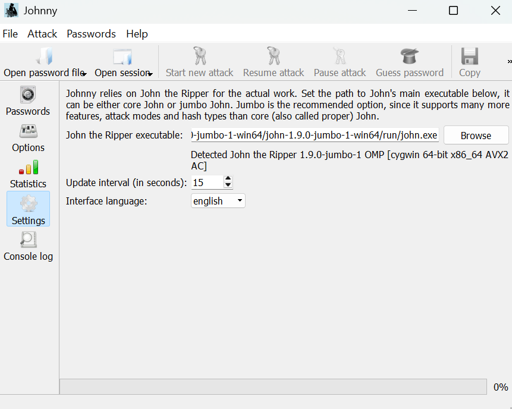
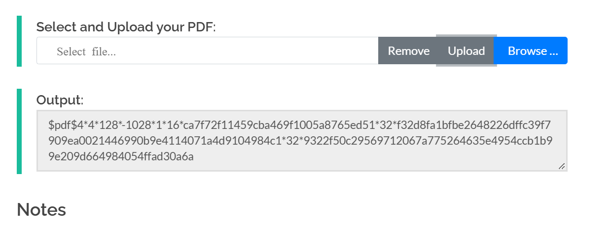
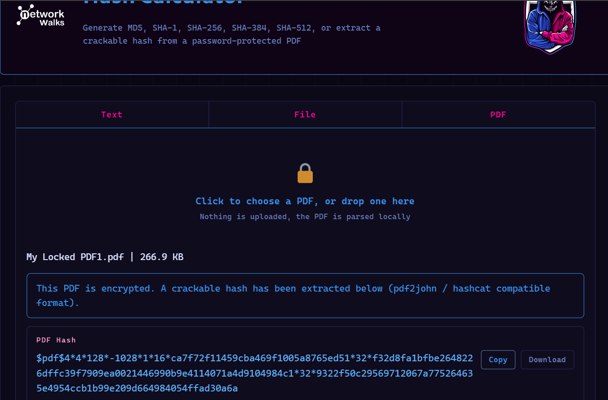
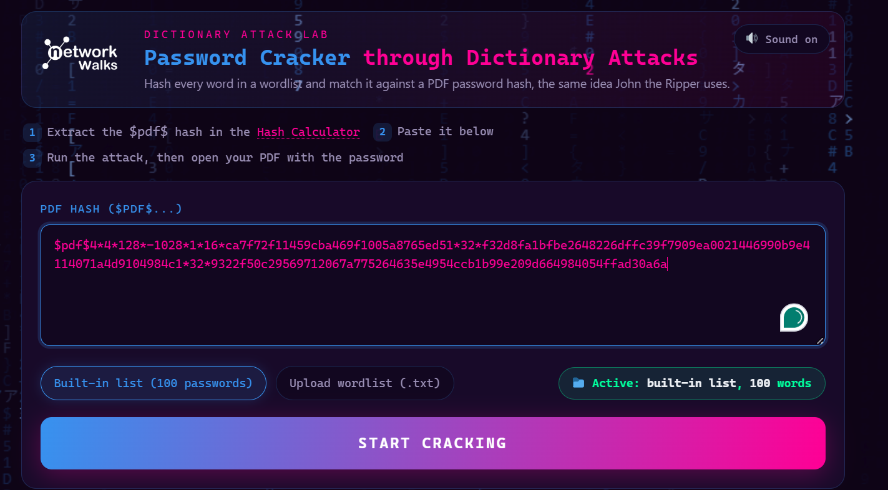
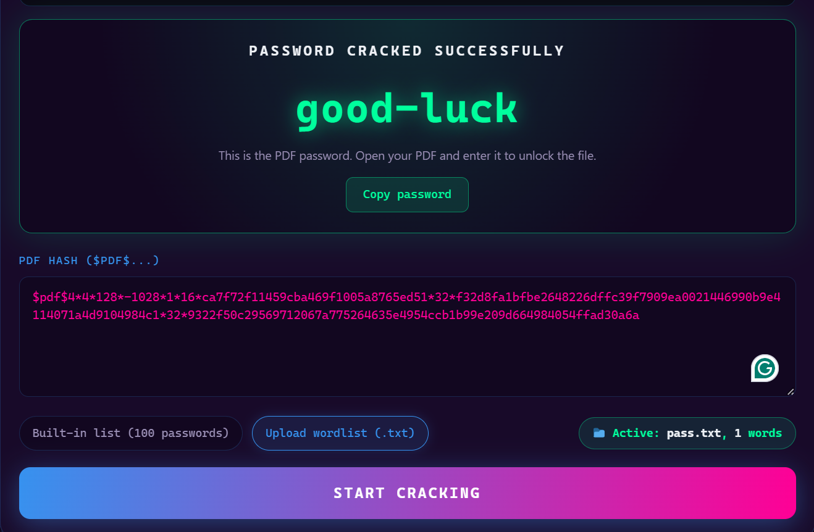

## NETWORKWALKS-B083-WK3-PM1-PM2-CRACKING-PASSWORD-USING-NW-TOOLS

# 🔐 Week 3 — PDF Password Cracking Lab

## 📌 Project Overview

This project was completed as part of **Week 3 of my Cybersecurity Internship**. The objective of this lab was to understand how password-protected PDF files can be tested in an authorized cybersecurity environment by extracting the PDF password hash and using password-cracking tools to recover the original password.

Two different approaches were used during this lab:

1. **John the Ripper (JTR) with the Johnny GUI**
2. **Networkwalks Hash Calculator and Password Cracker**

The lab was performed only on the provided internship PDF file for educational and authorized cybersecurity training purposes.

---

# 🎯 Objectives

The main objectives of this project were:

- Understand how password-protected PDF files store password-related information.
- Extract a `$pdf$...` hash from an encrypted PDF file.
- Configure and use **John the Ripper** on Windows.
- Use the **Johnny GUI** to interact with John the Ripper.
- Use the **Networkwalks Hash Calculator** to generate a PDF hash.
- Use the **Networkwalks Password Cracker** to perform password recovery.
- Compare a locally installed password-cracking workflow with a browser-based workflow.
- Verify the recovered password by successfully opening the protected PDF.
- Document the complete password-cracking process with screenshots.

---

# 🛠️ Tools Used

- **Windows PC**
- **John the Ripper (JTR)**
- **Johnny GUI**
- **Networkwalks Hash Calculator**
- **Networkwalks Password Cracker**
- **Web Browser**
- **My Locked PDF1.pdf**
- **Notepad**

---

# 🔹 Part 1 — John the Ripper (JTR) and Johnny

## Step 1 — Configure John the Ripper

John the Ripper was downloaded and configured on the Windows PC. The `john.exe` executable located inside the `run` folder was selected in the Johnny GUI settings.

### 📸 Screenshot

---

## Step 2 — Extract the PDF Hash

The encrypted PDF file was processed to obtain its password hash. The extracted value was in the `$pdf$...` format, which can be used by John the Ripper for password recovery.

The complete hash was copied and prepared for use with the cracking tool.

### 📸 Screenshot

---

## Step 3 — Start the Password-Cracking Process

The extracted PDF hash was provided to John the Ripper through the Johnny GUI. John then attempted different password candidates until a matching password was found.

### 📸 Screenshot

---

## Step 4 — Verify the Recovered Password

After the password was recovered using John the Ripper, it was entered into the protected PDF file.

The PDF opened successfully, confirming that the recovered password was correct.

### 📸 Screenshot

---

# 🔹 Part 2 — Networkwalks Hash Calculator and Password Cracker

The second part of the lab repeated the password-recovery process using the **Networkwalks Hash Calculator** and **Networkwalks Password Cracker**.

This provided a browser-based alternative to the locally installed John the Ripper workflow.

---

## Step 5 — Upload the Locked PDF to the Hash Calculator

The provided encrypted PDF file was uploaded to the Networkwalks Hash Calculator.

The tool processed the PDF and generated a password hash beginning with `$pdf$`.

### 📸 Screenshot

---

## Step 6 — Copy and Use the PDF Hash

The complete `$pdf$...` hash generated by the Hash Calculator was copied and entered into the password-cracking tool.

It is important to copy the entire hash without missing any characters.

### 📸 Screenshot

---

## Step 7 — Recover the Password

The password-cracking process was started using the extracted PDF hash.

The tool attempted different password candidates until it found a matching password.

### 📸 Screenshot

---

# 🔓 Step 8 — Open the Protected PDF

The recovered password was entered into the original encrypted PDF.

The PDF opened successfully, confirming that the password recovery process was successful.

### 📸 Screenshot

---

# 🧠 Key Concepts Learned

Through this lab, I learned how password-protected PDF files can be analyzed and tested in an authorized cybersecurity environment.

### 🔹 PDF Hash Extraction

A password-protected PDF can be processed to extract a specialized hash beginning with `$pdf$`. This hash contains information that password-cracking tools can use to test password candidates.

### 🔹 Password Cracking

Password-cracking tools attempt different password candidates and compare the resulting values against the target hash. When a matching candidate is found, the corresponding password can be recovered.

### 🔹 John the Ripper

John the Ripper is a password-security auditing and password-recovery tool. In this project, it was used through the Johnny graphical interface on Windows.

### 🔹 Browser-Based Password Cracking

The Networkwalks tools provided a browser-based alternative, allowing the PDF hash to be generated and then tested without manually configuring John the Ripper.

---

# 🔍 Comparison of the Two Methods

| Method | Hash Generation | Password Cracking | Environment |
|---|---|---|---|
| **John the Ripper + Johnny** | PDF hash extracted separately | John the Ripper | Windows |
| **Networkwalks Tools** | Networkwalks Hash Calculator | Networkwalks Password Cracker | Web Browser |

Both approaches demonstrated the same fundamental workflow:

**PDF → Hash → Password Cracking → Recovered Password → PDF Access**

---

# ✅ Results

The password-protected PDF was successfully processed using both password-recovery workflows.

### 🔹 John the Ripper Workflow

- ✅ John the Ripper was configured successfully.
- ✅ The PDF hash was obtained.
- ✅ The hash was provided to John through Johnny.
- ✅ The password was successfully recovered.
- ✅ The recovered password successfully unlocked the PDF.

### 🔹 Networkwalks Workflow

- ✅ The encrypted PDF was uploaded to the Hash Calculator.
- ✅ The `$pdf$...` hash was successfully generated.
- ✅ The complete hash was entered into the Password Cracker.
- ✅ The password was successfully recovered.
- ✅ The recovered password successfully unlocked the PDF.

---

# 📚 Skills Demonstrated

- 🔐 Password Security
- 🛡️ Cybersecurity Fundamentals
- 🔎 Hash Analysis
- 💻 John the Ripper
- 🖥️ Johnny GUI
- 🌐 Web-Based Security Tools
- 📄 PDF Security
- 🔑 Password Recovery
- 🧪 Security Lab Documentation
- 📝 Technical Documentation

---

# ⚠️ Ethical Considerations

Password-cracking tools should only be used in authorized environments, such as cybersecurity labs, educational exercises, penetration tests with permission, or files that you own or have explicit authorization to test.

This project was performed as part of an authorized cybersecurity internship laboratory exercise using the provided PDF file.

---

# 🎓 Conclusion

This Week 3 lab provided practical experience with PDF password security and password-recovery techniques. I used both **John the Ripper with Johnny** and the **Networkwalks Hash Calculator and Password Cracker** to understand the complete process of extracting a PDF hash, performing a password attack, recovering the password, and verifying the result by opening the protected PDF.

The lab helped strengthen my understanding of **hashes, password security, password-cracking tools, and practical cybersecurity workflows**.

---

# 👤 Author

**Name:** Malak Ashraf

**LinkedIn:** www.linkedin.com/in/malak-ashraf-196084370

**Internship:** Cybersecurity Internship — NETWORKWALKS

**Project:** Week 3 — PDF Password Cracking Lab
